# 🛵 Bolpur Mart Delivery Partner App

A modern, high-performance Progressive Web App (PWA) built for delivery partners to manage orders, navigate optimized routes, and track real-time earnings in Bolpur.

 
*(Replace with actual screenshot if available)*

## ✨ Key Features

- **📱 User-Friendly Dashboard**: Clean interface to view active, pending, and completed orders.
- **🗺️ Live Map Navigation**: Integrated Leaflet maps with OpenStreetMap to show specific pickup (Store) and delivery (Customer) locations relative to the partner.
- **📍 Real-Time Tracking**: Uses device GPS to calculate dynamic distances ("Lene Jao" & "Dene Jayo") and update routes.
- **💰 Dynamic Earnings**: Automatically calculates delivery fees based on distance (₹20 Base + ₹12/km).
- **💸 Earnings Tracker**: View "Aaj Kamaya" (Today's Earnings) instantly updated after every delivery.
- **🔔 Smart Notifications**: Real-time alerts for new orders.
- **🛠️ Offline Ready**: PWA support allows installation on mobile devices for a native app-like experience.

## 🛠️ Tech Stack

- **Frontend**: React 18, TypeScript, Vite
- **Styling**: Tailwind CSS, Shadcn UI, Lucide React Icons
- **Maps**: Leaflet.js, OpenStreetMap, React-Leaflet
- **Backend**: Firebase (Authentication, Firestore Database, Hosting)
- **Deployment**: Firebase Hosting

## 🔄 Order Flow

```mermaid
graph TD
    A[Partner Logs In] --> B{Status: Online?}
    B -- No --> C[Set Status to Online]
    B -- Yes --> D[Dashboard: Waiting for Orders]
    
    D --> E[New Order Notification 🔔]
    E --> F{Accept Order?}
    F -- Generic 'Decline' --> D
    F -- Yes --> G[Order Accepted]
    
    G --> H[Navigate to Store 🏪]
    H --> I[Mark 'Picked Up' 📦]
    
    I --> J[Navigate to Customer 🏠]
    J --> K[Mark 'Delivered' ✅]
    
    K --> L[Update Earnings 💰]
    L --> D
```



## 🚀 Getting Started

### Prerequisites

- Node.js (v18 or higher)
- Firebase Account

### Installation

1. **Clone the repository**
   ```bash
   git clone https://github.com/your-username/bolpur-mart-delivery.git
   cd bolpur-mart-delivery-app
   ```

2. **Install dependencies**
   ```bash
   npm install
   ```

3. **Environment Setup**
   Create a `.env` file in the `client` directory:
   ```env
   VITE_FIREBASE_API_KEY=your_api_key
   VITE_FIREBASE_AUTH_DOMAIN=your_project.firebaseapp.com
   VITE_FIREBASE_PROJECT_ID=your_project_id
   VITE_FIREBASE_STORAGE_BUCKET=your_bucket.appspot.com
   VITE_FIREBASE_MESSAGING_SENDER_ID=your_sender_id
   VITE_FIREBASE_APP_ID=your_app_id
   ```

4. **Run Locally**
   ```bash
   npm run dev
   ```

## 📱 PWA Installation

1. Open the app in Chrome/Safari on your mobile.
2. Tap "Add to Home Screen".
3. The app will install and function like a native application.

## 📦 Deployment

Deploy to Firebase Hosting with a single command:

```bash
npm run build
npx firebase deploy --only hosting
```

## 📂 Project Structure

```
client/
├── src/
│   ├── components/   # Reusable UI components (OrderCard, MapView, etc.)
│   ├── hooks/        # Custom hooks (useAuth, useLocation, useEarnings)
│   ├── lib/          # Utilities (Firebase, Location calculations)
│   ├── pages/        # App pages (Dashboard, Login, History)
│   └── main.tsx      # Entry point
├── public/           # Static assets (Manifest, Icons)
└── index.html        # HTML template
```

## 🤝 Contributing

1. Fork the project
2. Create your feature branch (`git checkout -b feature/AmazingFeature`)
3. Commit your changes (`git commit -m 'Add some AmazingFeature'`)
4. Push to the branch (`git push origin feature/AmazingFeature`)
5. Open a Pull Request

---

Made with ❤️ by the Bolpur Mart Team
